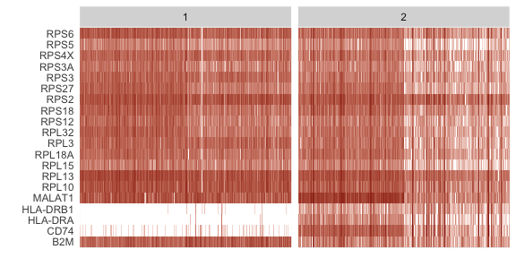
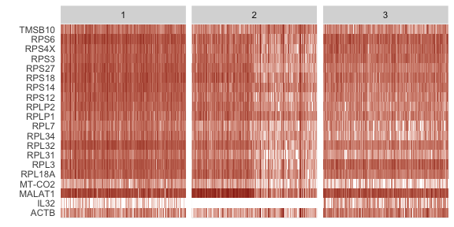

<!-- README.md is generated from README.Rmd. Please edit that file -->
HIPPO
=====

Single cell UMI analysis tool that focuses on zero-inflation to detect biological heterogeneity. 

Based on a method in this pre-print:
[Demystifying "drop-outs" in single cell UMI data](https://www.biorxiv.org/content/10.1101/2020.03.31.018911v1)

Getting Started
---------------

These instructions will get you a copy of the project up and running on your local machine for development and testing purposes. See deployment for notes on how to deploy the project on a live system.

Prerequisites
-------------

HIPPO works on the SingleCellExperiment object. You can install the library like the following.

``` r
if (!requireNamespace("BiocManager", quietly = TRUE))
    install.packages("BiocManager")
BiocManager::install("SingleCellExperiment")
```

Installing
----------

HIPPO is under review for Bioconductor and CRAN submission. You can download the developer version as below. Please allow up to 5 minutes to completely compile the vignette.

``` r
devtools::install_github("tk382/HIPPO", build_vignettes = TRUE)
```

Read the data
-------------

The data set is available in the following [link](http://imlspenticton.uzh.ch/robinson_lab/DuoClustering2018/DuoClustering2018.tar.gz), where the detailed explanation is available [here](https://github.com/markrobinsonuzh/scRNAseq_clustering_comparison). Note that the file is very large (3.3GB). We use Zhengmix4eq data set. Alternatively, a toydata is created by subsetting from this data.

``` r
sce <- readRDS(url("https://github.com/tk382/HIPPO/raw/master/sce_Zhengmix4eq.rds","rb"))
```

``` r
data(toydata)
sce = toydata
```

You can start from a matrix object and create SingleCellExperiment object.

``` r
# X = readRDS("../zhengmix4eq_counts.rds")
# sce = SingleCellExperiment(assays = list(counts = X))
```

Diagnostic Plot
---------------

This plot shows the zero inflation compared to the expected Poisson line. If most genes don't align with the black line, it shows that there is cell heterogeneity driving the zero inflation.

``` r
hippo_diagnostic_plot(sce, 
                      show_outliers = TRUE, 
                      zvalue_thresh = 15)
```


Feature Selection and Hierarchical Clustering
---------------------------------------------

HIPPO assumes that the count matrix is placed in <sce@assays@data>$counts. Some objects that we found online have the count matrix in <sce@assays>$data$counts. In this case, HIPPO will throw an error because it cannot found a count matrix. In this case, you have to create another SingleCellExperiment object to assign the count matrix in the correct slot.

Next, you can run hippo function to do the pre-processing that simutlaneously conducts feature selection and hierarchcial clustering. There are three arguments that help you decide the stopping criterion of clustering procedure.

K is the maximum number of clusters that you want. HIPPO will return the clustering results for all k = 2, 3, ..., K, so you can overestimate the number of potential clusters. The default is 10, but users are highly recommended to adjust this.

z\_threshold is the feature selection criterion. For each round of hierarchical clustering, hippo will find outlier genes where the z-value of significance is greater than the threshold. For example, if you would like to select genes with p-values less than 0.05, z\_threshold would be 1.96. The default threshold is 2, but users can use their discretion to change this value.

outlier\_proportion is the number of outlier genes to allow. The default is 0.01 (1%) which means the clustering procedure will automatically stop if there are less than 1% of genes remain as important features. With the example data set, the default choice has empirically worked well.

``` r
set.seed(20191031)
sce = hippo(sce, 
            K = 4, 
            z_threshold = 2, 
            outlier_proportion = 0.01,
            verbose=TRUE)
#> [1] "K = 2.."
#> [1] "K = 3.."
#> [1] "K = 4.."
```

Dimension Reduction for Each Round of HIPPO
-------------------------------------------

We offer two dimension reduction methods: umap and tsne. And we offer two separate visualization functions.

``` r
sce = hippo_dimension_reduction(sce, method="umap")
hippo_umap_plot(sce, k = 1:4)
```


``` r
sce = hippo_dimension_reduction(sce, method="tsne")
hippo_tsne_plot(sce)
```


Visualize the selected features at each round
---------------------------------------------

This function shows how the zero-inflation decreases as HIPPO proceeds in the clustering. This function has arguments called switch\_to\_hgnc and ref. These aim to provide the users an option to change the gene names from ENSG IDs to HGNC symbols for ease of understanding. Many SingleCellExperiment objects have such data embedded in rowData(sce). Users can create a data frame with ensg and hgnc columns for the genes, and HIPPO will automatically switch the row names of the count matrix from ENSG IDs to HGNC symbols. The default is set to FALSE, assuming that the row names are already HGNC symbols.

``` r
data(ensg_hgnc)
zero_proportion_plot(sce, 
                     switch_to_hgnc = TRUE, 
                     ref = ensg_hgnc)
```


``` r
hippo_feature_heatmap(sce, k = 2, 
                      switch_to_hgnc = TRUE, 
                      ref = ensg_hgnc, 
                      top.n = 20)
```



``` r
hippo_feature_heatmap(sce, k = 3, 
                      switch_to_hgnc = TRUE, 
                      ref = ensg_hgnc, 
                      top.n = 20)
```



Differential Expression Example
-------------------------------

We also offer a differential expression analysis tool.

This function also has an option to switch the gene names to HGNC symbols. top.n argument lets users choose how many top genes to show in the box plot. The default is 5.

The labels of boxplots are aligned with the t-SNE or UMAP plots above. When K is equal to 2, the color codes match with the cell groups as separated in the dimension reduction plot.

``` r
sce = hippo_diffexp(sce, 
                  top.n = 5, 
                  switch_to_hgnc = TRUE, 
                  ref = ensg_hgnc)
```


Each round of differential expression test results are also saved in the list of data frames.

``` r
head(get_hippo_diffexp(sce, 1))
#>               genes  meandiff         sd         z
#> 288 ENSG00000019582 15.019675 0.09017091 166.56896
#> 326 ENSG00000204287  8.076252 0.06412014 125.95499
#> 328 ENSG00000196126  6.663794 0.05905990 112.83109
#> 340 ENSG00000223865  4.920349 0.05078864  96.87894
#> 73  ENSG00000163220  4.122195 0.04564481  90.31026
#> 75  ENSG00000143546  3.827656 0.04388558  87.21899
head(get_hippo_diffexp(sce, 2))
#>               genes meandiff        sd        z
#> 74  ENSG00000109475 7.173621 0.1288282 55.68364
#> 25  ENSG00000177954 9.353901 0.1688552 55.39598
#> 56  ENSG00000144713 9.563209 0.1727884 55.34636
#> 116 ENSG00000112306 8.680749 0.1600465 54.23892
#> 46  ENSG00000071082 7.158033 0.1321781 54.15444
#> 173 ENSG00000177600 8.166465 0.1521661 53.66808
```
